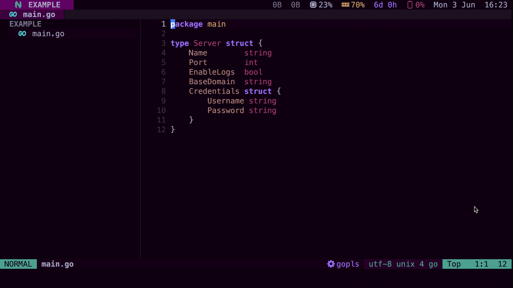

# Go Tags

A Neovim plugin for modifying Go struct tags using [gomodifytags](https://github.com/fatih/gomodifytags).

Supports modified buffers.



## Requirements

- `nvim-treesitter`
- `gomodifytags`: install with `go install github.com/fatih/gomodifytags@latest`

## Install

For example, with [packer.nvim](https://github.com/wbthomason/packer.nvim):

```lua
use({
  'devkvlt/go-tags.nvim',
  requires = { 'nvim-treesitter/nvim-treesitter' },
})
```

## Setup

```lua
require('go-tags').setup({
  commands = {
    ['GoTagsAddJSON'] = { '-add-tags', 'json' },
    ['GoTagsRemoveJSON'] = { '-remove-tags', 'json' },
  },
})
```

This sets up the Vim commands to call `gomodifytags` with the given flags. You
can be creative and add any flags that make sense.
